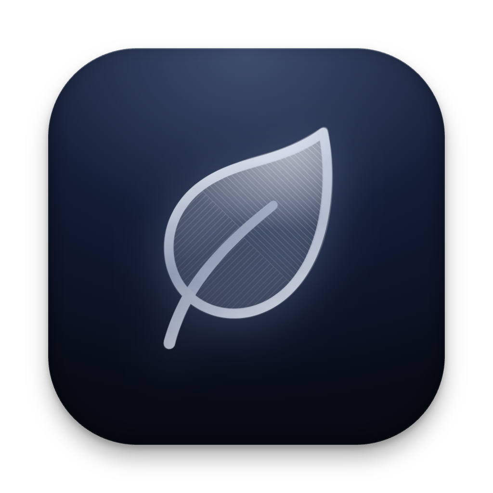
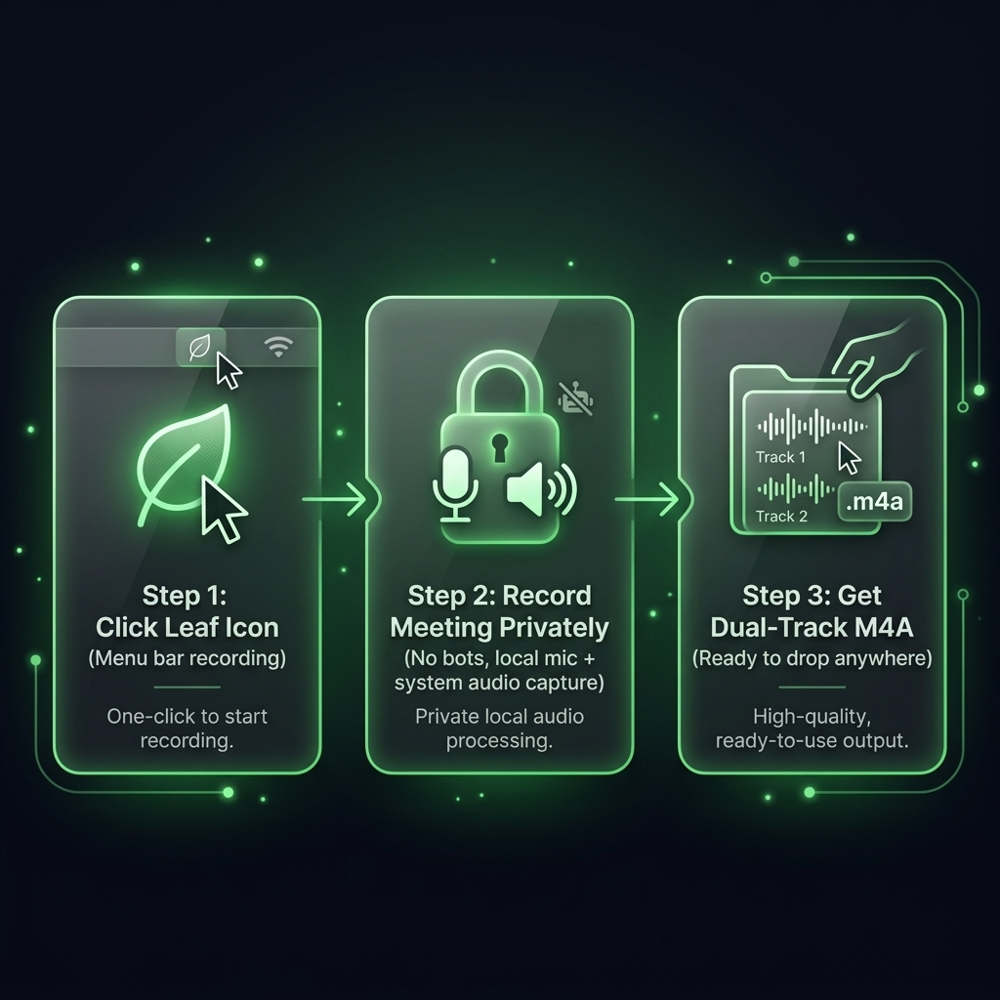

<p align="center">
  
</p>

# SilentSpy

**Silent, bot-free meeting recorder for macOS. Record any call discreetly—no intrusive bots, no "transcribing" announcements, and zero setup. Just record, drag & drop to transcribe.**

SilentSpy is a lightweight macOS menu bar app that records your meetings in complete privacy. Unlike cloud AI meeting assistants that send disruptive bots into your Zoom, Google Meet, or Microsoft Teams calls, SilentSpy runs 100% locally. It captures dual-channel audio (your mic on one track, system audio on the other) directly to disk so you can drop the recording into your favorite transcription or AI tool whenever you're ready.


[](LICENSE)

---

## Why SilentSpy?

### 🤫 100% Discreet & Bot-Free
Say goodbye to awkward meeting bots ("*Fireflies AI has joined the call*") and invasive cloud recording notifications. SilentSpy captures your computer's audio locally via macOS ScreenCaptureKit. No bots join your meeting, no third-party servers see your data, and nobody on the call receives unwanted alerts.

### 🎙️ Independent Dual-Channel Separation
SilentSpy automatically splits your audio into two separate channels in a single stereo `.m4a` file:
* **Channel 1 (Left)**: Your microphone input.
* **Channel 2 (Right)**: Computer & call audio (Zoom, Google Meet, Teams, Slack Huddle, Webex, Browser).

This separation makes post-meeting processing, AI speaker diarization, and custom mixing incredibly clean and effortless.

### ⚡ Drag & Drop Workflow for AI Transcription
As soon as your call ends, click "Reveal in Finder" or open your target folder and drag the `.m4a` file straight into open-source local transcription tools like **whisper.cpp**, **MacWhisper**, or **FluidVoice** (or cloud tools like Fireflies and Otter). You get pristine audio quality without locking your data into a proprietary subscription cloud.

---

## Everything You Need for Frictionless Recording

### ⚡ Zero-Lag Direct-to-Disk Streaming
SilentSpy streams compressed AAC audio directly to your SSD on the fly. Because memory footprint stays minimal (~few megabytes) even during multi-hour marathons, your Mac stays fast and responsive.

### 🖥️ Native macOS Menu Bar Control
SilentSpy lives discreetly in your menu bar. Start, pause, or stop recordings instantly with quick global shortcuts or a single click.

### 📊 Real-Time Visual Meters
Always be certain your audio is being captured. Live VU meters with peak hold indicators and dynamic wave visualizers provide visual peace of mind for both microphone and system sound.

---

<p align="center">
  
</p>

1. **Start discreetly**: Click the leaf menu bar icon or trigger a shortcut when your meeting begins.
2. **Record privately**: Conduct your meeting with zero bots, popups, or cloud tracking. Your mic and system audio are captured locally onto separate tracks.
3. **Get your M4A**: Stop recording to get a clean dual-channel `.m4a` file ready to drop into any audio workflow or AI tool.

---

## Perfect For...

* **Executive & Private Meetings**: Document crucial discussions without introducing third-party bots or privacy compliance headaches.
* **Sales & User Interviews**: Capture full-fidelity prospect audio without making participants feel self-conscious.
* **Podcasts & Co-hosted Calls**: Keep host voice and remote guest voice completely separate for painless editing.
* **Internal Syncs & Huddles**: Quickly capture notes for yourself to transcribe locally with Whisper.

---

## Built on Native macOS Frameworks

SilentSpy completely bypasses third-party virtual audio cables (like BlackHole or Soundflower) by utilizing Apple's modern native APIs:

* **System & App Audio**: Captured via high-performance `ScreenCaptureKit`.
* **Microphone Input**: Managed via `AVAudioEngine`.
* **Format**: Standard 48,000 Hz, MPEG-4 AAC (`.m4a`).

---

## Quick Start

### Build & Run Locally

Build and launch the application immediately:

```bash
make run
```

### Useful Makefile Commands

* `make` — Builds `SilentSpy.app` in `./build/`
* `make install` — Installs `SilentSpy.app` to `/Applications/`
* `make reset-perms` — Resets Microphone & Screen Recording permissions for testing
* `make clean` — Cleans build artifacts

---

## Technical Specifications

| Parameter | Specification |
| :--- | :--- |
| **Compatibility** | macOS 14.0+ (Apple Silicon & Intel) |
| **Audio Encoding** | 48,000 Hz, MPEG-4 AAC (.m4a) |
| **Channel Mapping** | Stereo (Ch 1 / Left: Mic, Ch 2 / Right: System Audio) |
| **Storage Destination** | `~/Music/SilenSpy-Recordings/` (Configurable) |
| **Permissions Required** | Microphone & Screen/System Audio Capture |

---

## License

This project is licensed under the **GNU General Public License v2.0** (GPL-2.0). See the [LICENSE](LICENSE) file for full details.
